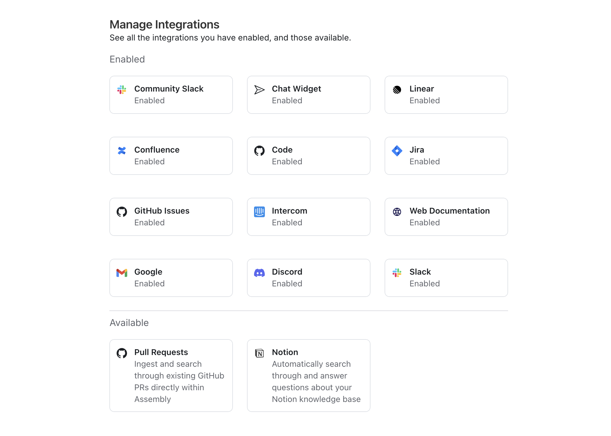

Assembly connects to the tools you already use, bringing all your customer context into one place. Below is a comprehensive list of all available integrations, organized by category.

---

## Communication Channels

Connect your team communication tools to capture customer conversations, bugs, feature requests, and support threads.

<AccordionGroup>
  <Accordion
    icon={
      
    }
    title="Slack"
  >
    **Stay in sync with all customer bugs/issues, or feature request threads.**
    
    Click on the Slack integration and hit the <b>enable</b> button. After you have enabled the integration, select the <b>customer channels</b> or <b>community channels</b> sections and add the channels you'd like to collect support tickets or feedback from.

 

    <b>Private Channels</b>
     
    If you would like to add private customer channels or community channels to Assembly's ticket inbox, (1) @Assembly in a selected channel and then (2) reselect the same channel in the "select customer channels" dropdown.
 

<b>Shortcuts</b>
Quick create Linear, Jira, or other external tickets directly from Slack by clicking the "+" button on the "create shortcut" section and selecting an emoji + destination to create the ticket.
 
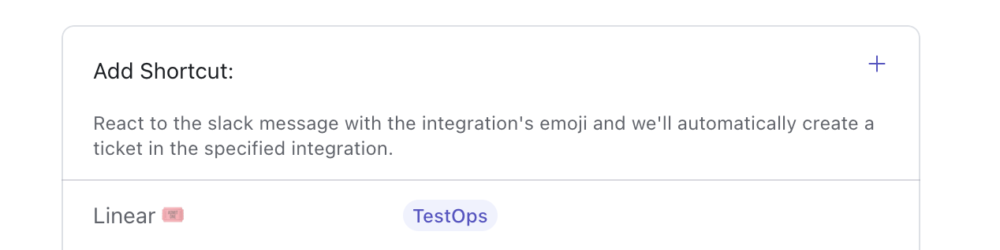
  </Accordion>

  <Accordion
    icon={
      
    }
    title="Community Slack"
  >
    **Stay in sync with all your community's bugs/issues, or feature request threads.**
    
    Connect a separate Slack workspace for your community. Works the same way as the customer Slack integration but designed for community-facing workspaces where you collect feedback from users and developers.
  </Accordion>

  <Accordion
    icon={
      
    }
    title="Discord"
  >
    **Stay up to date and interact with feature requests, bugs, and issues from your Discord community.**
    
    On the Manage Integrations page, click on the Discord integration and hit the "enable" button. Follow the sign-in instructions to link Discord to Assembly.

 
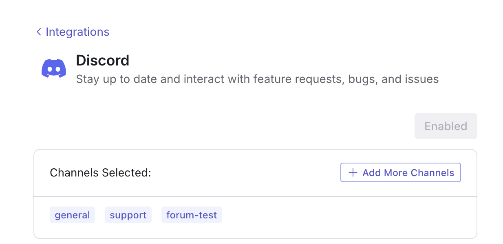

 
After you have set up the integration, select the "customer channels" section and add the channels you'd like to collect support tickets or feedback from.

<b>Shortcuts</b>
To quick create Linear, Jira, or other external tickets directly from Discord, click the "+" button on the "create shortcut" section, select an emoji or "/" (slash) command, and a destination to create the ticket.
 

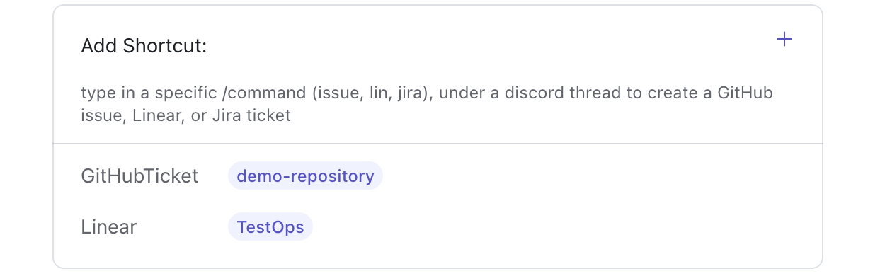

<b>Moderators</b>
If your company email is not connected to your or your teams' Discord accounts, manually link all of these accounts to respond to Discord messages from the platform.

 

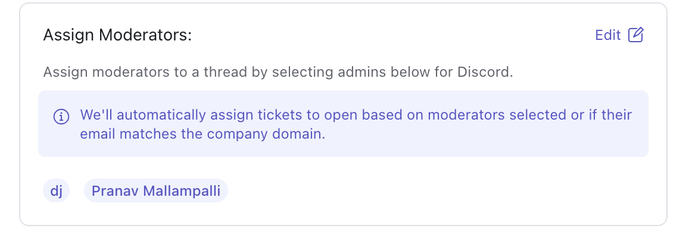
  </Accordion>

  <Accordion
    icon={
      
    }
    title="Gmail"
  >
    **Sync Gmail requests into Assembly. You can add multiple Gmail accounts.**
    
    To connect a support email, hit the enable button and follow the sign-in instructions. 

In order to link a forwardable account or Google Group, create a group with an authenticable email and follow the same sign-in instructions as above.
 

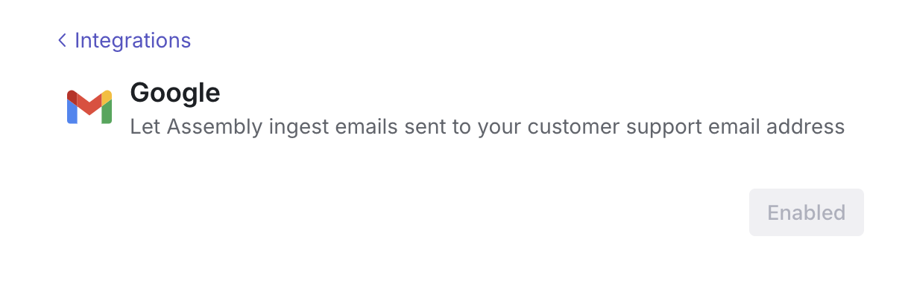
  </Accordion>

  <Accordion
    icon={
      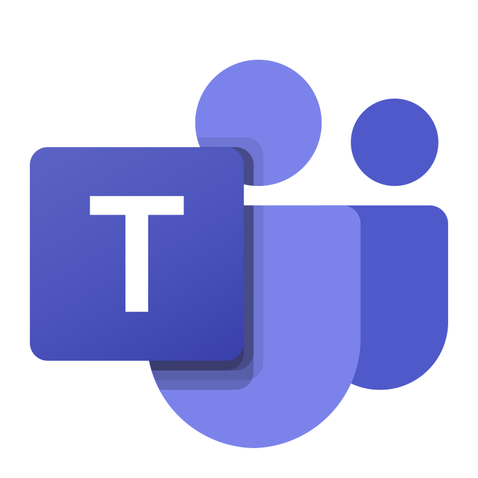
    }
    title="Microsoft Teams"
  >
   Coming soon...
  </Accordion>

  <Accordion icon="message" title="Chat Widget">
    **Turn your content into an AI search and support copilot with in-app embedded chat.**
    
    Once enabled, an API key will be generated. This will be used when embedding the iframe inside your application or on a webpage.
 

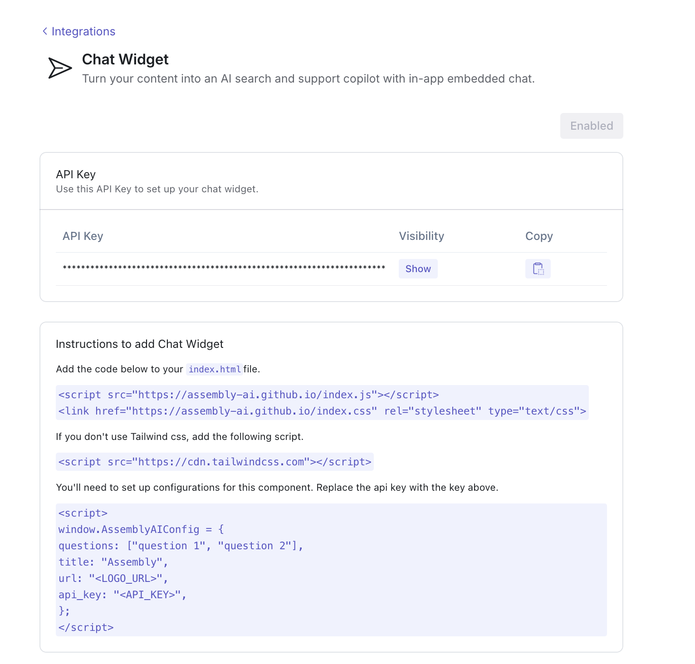

 
After this, follow the instructions on the chat widget integration page to complete installation.
  </Accordion>
</AccordionGroup>

---

## Support Systems

Integrate with your help desk and support platforms to sync tickets bi-directionally.

<AccordionGroup>
  <Accordion
    icon={
      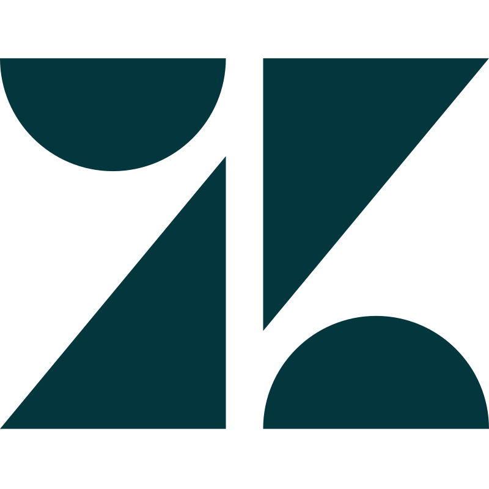
    }
    title="Zendesk"
  >
    **Auto-sync tickets from Zendesk to and from Assembly.**
    
    Connect your Zendesk account to enable bi-directional ticket synchronization. Tickets created in Zendesk will appear in Assembly, and you can manage support workflows across both platforms seamlessly.

    - Automatically import Zendesk tickets into Assembly
    - Sync ticket status, comments, and updates in real-time
    - Map Zendesk ticket fields to Assembly fields
  </Accordion>

  <Accordion
    icon={
      
    }
    title="Intercom"
  >
    **Sync Intercom support requests into Assembly.**
    
    Connect your Intercom account to bring customer conversations and support requests into Assembly. This allows your team to have full visibility into customer interactions alongside other data sources.

    - Import Intercom conversations as tickets
    - Sync customer data and conversation history
    - Track support interactions across all channels
  </Accordion>
</AccordionGroup>

---

## Ticketing Systems

Connect your issue tracking and project management tools to auto-generate tickets from conversations.

<AccordionGroup>
  <Accordion
    icon={
      
    }
    title="Jira"
  >
    **Auto-generate Jira tickets from Slack or Discord. Sync tickets by project mapped to a specific account.**
    
    Connect your Jira account to enable automatic ticket creation from customer conversations. When a customer reports a bug or feature request in Slack or Discord, you can instantly create a Jira ticket with a slash command or emoji reaction.

    - Create Jira tickets directly from Slack/Discord with shortcuts
    - Map projects to specific customer accounts
    - Sync ticket status and updates back to Assembly
    - Automatically link conversations to Jira issues
  </Accordion>

  <Accordion
    icon={
      
    }
    title="Linear"
  >
    **Auto-generate Linear tickets from Slack or Discord. Sync tickets by project mapped to a specific account.**
    
    Connect your Linear workspace to streamline your issue tracking workflow. Create Linear issues directly from customer conversations without leaving your communication tools.

    - Create Linear issues from Slack/Discord with shortcuts
    - Sync ticket status bidirectionally
    - Map Linear teams and projects to customer accounts
    - Automatically populate issue details from conversation context
  </Accordion>

  <Accordion icon="github" title="GitHub Issues and Discussions">
    **Stay up to date with GitHub issues and discussions, and automate GitHub issue creation with a slash "/" command or emojis.**
    
    To connect your GitHub, ensure you have admin privileges to enable the integration. Hit the "enable" button and follow the sign-in instructions.

    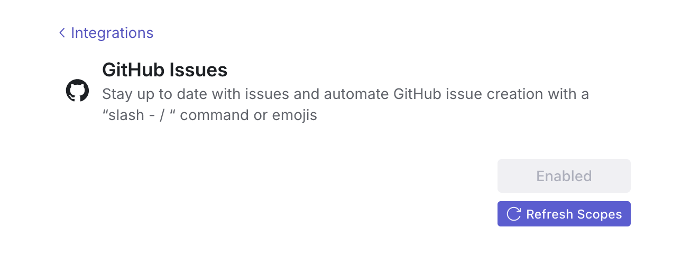

    Select the repositories Assembly will have limited access to with approval if necessary.

    Once the integration is enabled, select the "repositories" (the customer channels) whose activity will come to Assembly.
    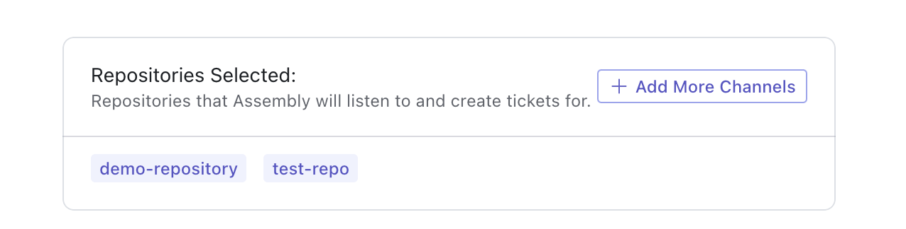
 

<b>Moderators</b>
If your company email is not connected to your or your teams' GitHub accounts, manually link all of these accounts to respond to GitHub issues.
 

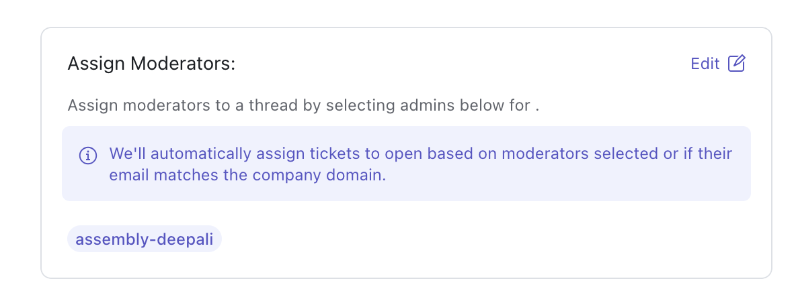
  </Accordion>
</AccordionGroup>

---

## CRM & Customer Data

Connect your CRM systems to enrich customer context with account data, contacts, opportunities, and more.

<AccordionGroup>
  <Accordion
    icon={
      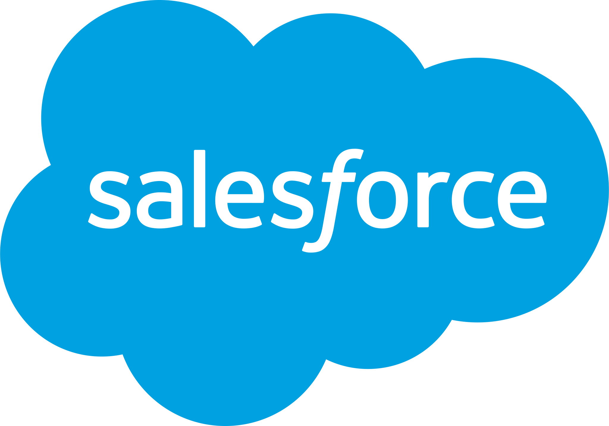
    }
    title="Salesforce"
  >
    **Connect your Salesforce account to see customer data in Assembly.**
    
    <b>Enable the Salesforce integration</b>
     
    On the Manage Integrations page, click on the Salesforce integration and hit the <b>enable</b> button. Follow the sign-in instructions to connect Salesforce to Assembly.
     
    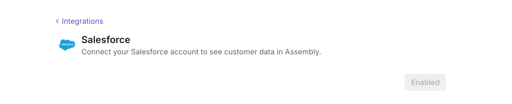
     
    <b>Select which Salesforce objects to sync</b>
     
    After enabling the integration, Assembly will present a table mapping step where you can choose which Salesforce objects you want to bring into Assembly. You can map <b>Accounts</b>, <b>Contacts</b>, <b>Opportunities</b>, and any <b>custom objects</b> from Salesforce.
     
    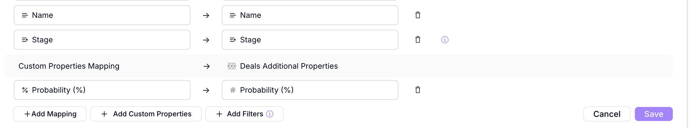
     
    <b>Review how objects map into Assembly</b>
     
    The Salesforce objects you select will be mapped to their Assembly equivalents: <b>Accounts → Accounts</b>, <b>Contacts → Contacts</b>, <b>Opportunities → Deals</b>, and <b>custom objects → custom objects</b> in Assembly. Review these mappings to ensure they match how your team works.
     
    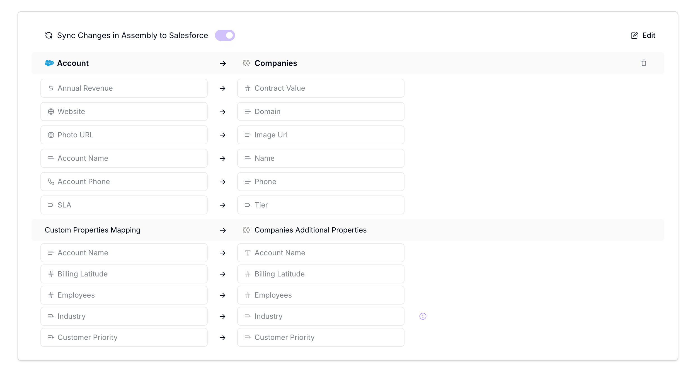
     
    <b>Use auto-mapping for fields</b>
     
    You can use Assembly's auto-mapping to quickly align common Salesforce fields (such as name, owner, status, and amounts) to Assembly fields. Adjust any individual field mappings as needed before saving to finalize your Salesforce integration.
  </Accordion>

  <Accordion
    icon={
      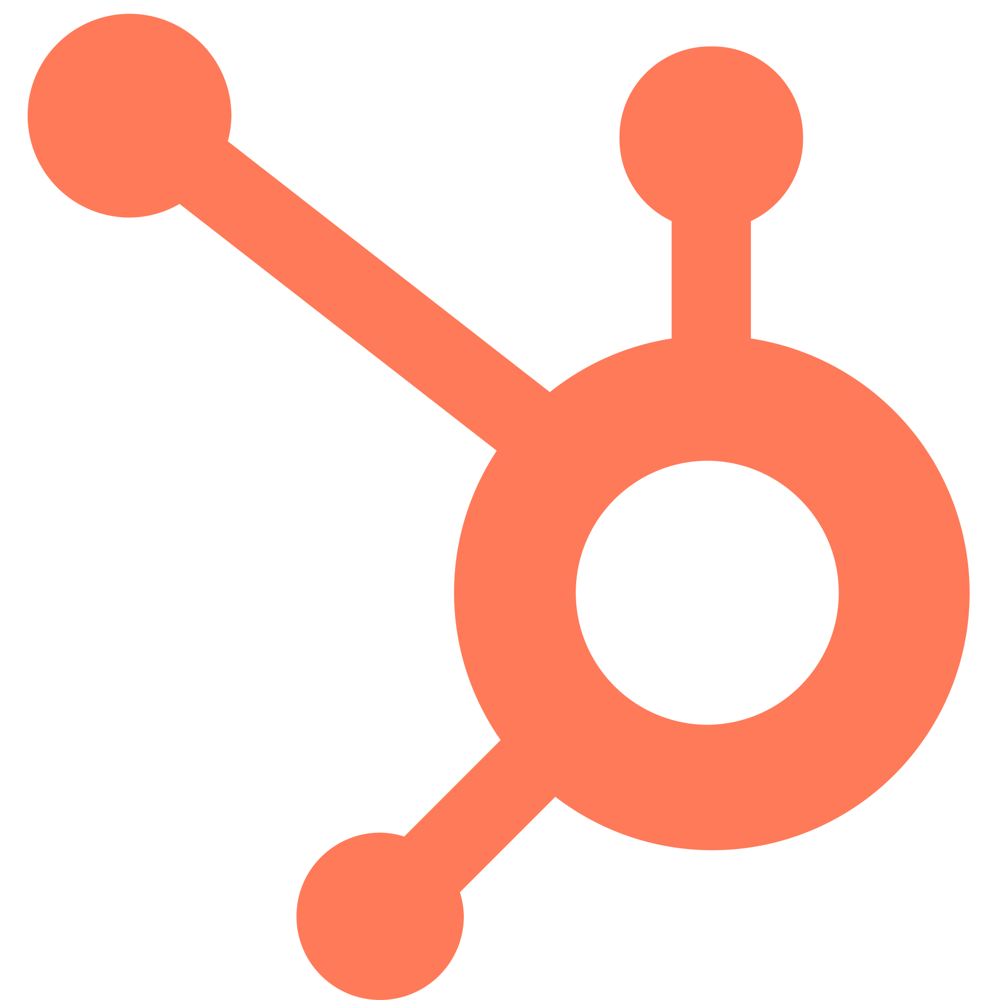
    }
    title="HubSpot"
  >
    **Connect your HubSpot account to see customer data in Assembly.**
    
    Sync your HubSpot CRM data including contacts, companies, and deals into Assembly. This enables your team to see the full customer picture when handling support requests and conversations.

    - Import HubSpot contacts and companies
    - Sync deal stages and pipeline data
    - Map HubSpot properties to Assembly fields
    - Enable customer context in conversations
  </Accordion>
</AccordionGroup>

---

## Usage Data & Analytics

Connect your product analytics and business intelligence tools to understand customer behavior and usage patterns.

<AccordionGroup>
  <Accordion
    icon={
      
    }
    title="PostHog"
  >
    **Connect your PostHog account to see usage data in Wavelength.**
    
    Bring product analytics data from PostHog into Wavelength to understand how customers are using your product. Correlate usage patterns with support requests and customer conversations.

    - View user session data and events
    - Understand feature adoption by account
    - Correlate usage patterns with support tickets
  </Accordion>

  <Accordion
    icon={
      
    }
    title="Pendo"
  >
    **Connect Pendo to enable product analytics in Wavelength.**
    
    Integrate your Pendo account to access product usage analytics, feature adoption data, and user behavior insights directly within Wavelength.

    - Access product analytics alongside customer data
    - Track feature adoption by customer segment
    - Understand user engagement patterns
  </Accordion>

  <Accordion
    icon={
      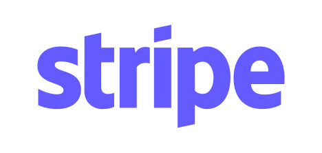
    }
    title="Stripe"
  >
    **Sync Stripe subscriptions and revenue data into Wavelength.**
    
    Connect your Stripe account to bring subscription and revenue data into your customer view. Understand MRR, subscription status, and billing history for each account.

    - View subscription details by account
    - Track MRR and revenue metrics
    - See billing history and payment status
    - Correlate revenue with support and engagement data
  </Accordion>

  <Accordion
    icon={
      
    }
    title="Looker"
  >
    **Pull in Looker dashboards and data into accounts.**
    
    Connect Looker to bring business intelligence dashboards and data into your account views. We recommend authenticating with a service account for better permission control.

    - Embed Looker dashboards in account views
    - Access Looker data within Assembly
    - Configure which dashboards are visible per account
  </Accordion>

  <Accordion icon="database" title="BigQuery">
    **Connect BigQuery to enable data warehouse analytics in Wavelength.**
    
    Integrate your BigQuery data warehouse to access custom analytics, usage metrics, and business data directly within Wavelength.

    - Query BigQuery datasets alongside customer data
    - Build custom analytics views per account
    - Access data warehouse insights in context
  </Accordion>

  <Accordion
    icon={
      
    }
    title="Fathom Analytics"
  >
    **Connect your Fathom account to see analytics data in Wavelength.**
    
    Integrate Fathom privacy-focused web analytics to see website and product usage data alongside your customer information.
  </Accordion>
</AccordionGroup>

---

## Meeting Intelligence & Note Takers

Connect AI meeting assistants to automatically transcribe, analyze, and sync meeting notes with customer accounts.

<AccordionGroup>
  <Accordion
    icon={
      
    }
    title="Gong"
  >
    **Connect your Gong account to see customer data in Assembly.**
    
    Sync call recordings, transcripts, and conversation intelligence from Gong. Access sales and customer success call insights directly within customer account views.

    - Import call recordings and transcripts
    - Sync conversation insights and topics
    - Link calls to customer accounts
    - Surface key moments from customer conversations
  </Accordion>

  <Accordion
    icon={
      
    }
    title="Fireflies"
  >
    **Connect your Fireflies account to automatically transcribe and analyze your meetings in Assembly.**
    
    Bring meeting transcriptions and AI-generated summaries from Fireflies into Assembly. Link meetings to customer accounts for a complete view of all customer interactions.

    - Auto-sync meeting transcripts
    - Access AI meeting summaries
    - Link meetings to customer accounts
    - Search across all meeting content
  </Accordion>

  <Accordion
    icon={
      
    }
    title="Attention"
  >
    **Connect your Attention account to enable AI note-taking capabilities in Wavelength.**
    
    Integrate Attention's AI-powered meeting notes and insights. Automatically capture action items, key topics, and customer sentiments from your meetings.
  </Accordion>
</AccordionGroup>

---

## Knowledge Base & Documentation

Connect your documentation and knowledge management tools to enable AI-powered search and answers.

<AccordionGroup>
  <Accordion
    icon={
      
    }
    title="Confluence"
  >
    **Ingest your Confluence documents (BETA).**
    
    Connect Confluence to bring your team's documentation into Assembly's AI search. Enable your support team and AI assistants to find and reference internal knowledge.

    - Index Confluence spaces and pages
    - Enable AI-powered search across documentation
    - Reference docs in customer conversations
  </Accordion>

  <Accordion
    icon={
      
    }
    title="Notion"
  >
    **Automatically search through and answer questions about your Notion knowledge base.**
    
    Connect your Notion workspace to enable AI-powered search across your documentation, wikis, and knowledge base content.

    - Index Notion pages and databases
    - Enable natural language search
    - Use Notion content for AI-assisted responses
  </Accordion>

  <Accordion
    icon={
      
    }
    title="Web / URL Scraping"
  >
    **Automatically search through and answer questions about your web docs.**
    
    Add URLs to your public documentation, help center, or marketing site. Assembly will index the content and enable AI-powered search and question answering.

    - Index public documentation sites
    - Enable AI search across web content
    - Keep content synced with automatic re-indexing
  </Accordion>
</AccordionGroup>

---

## Developer Tools & Code

Connect your code repositories to enable AI-powered code search and understanding.

<AccordionGroup>
  <Accordion icon="github" title="GitHub Code">
    **Automatically search through and answer questions about your code.**
    
    Connect your GitHub repositories to enable AI-powered code search. Your AI assistant can understand your codebase and answer technical questions about implementation details.

    - Index repository code
    - Enable natural language code search
    - AI understands your codebase context
  </Accordion>

  <Accordion
    icon={
      
    }
    title="GitHub Pull Requests"
  >
    **Ingest and search through existing GitHub PRs directly within Assembly.**
    
    Connect your GitHub repositories to index pull requests. Search through PR descriptions, code changes, and discussions to understand what's been shipped and when.

    - Index PR descriptions and discussions
    - Search across merged changes
    - Understand code change history
  </Accordion>
</AccordionGroup>

---

## Scheduling & Calendar

Connect your calendar tools to see meeting context alongside customer data.

<AccordionGroup>
  <Accordion
    icon={
      
    }
    title="Google Calendar"
  >
    **Connect your Google Calendar accounts to see your events in Assembly. You can add multiple calendar accounts.**
    
    Sync your Google Calendar to see upcoming and past meetings with customers. Link calendar events to customer accounts for complete meeting history.

    - View upcoming customer meetings
    - See meeting history by account
    - Add multiple calendar accounts
  </Accordion>
</AccordionGroup>

---

## Data Sources

Connect spreadsheet and data tools to import customer data.

<AccordionGroup>
  <Accordion
    icon={
      
    }
    title="Google Sheets"
  >
    **Connect your Google Sheet account to see customer data in Assembly.**
    
    Import data from Google Sheets to populate customer accounts or enrich existing data. Useful for importing customer lists, CSVs, or maintaining manual data alongside automated syncs.

    - Import customer data from spreadsheets
    - Map sheet columns to Assembly fields
    - Keep data synced with automatic updates
  </Accordion>
</AccordionGroup>

---

## API Integration

Build custom integrations using the Assembly API.

<AccordionGroup>
  <Accordion
    icon={
      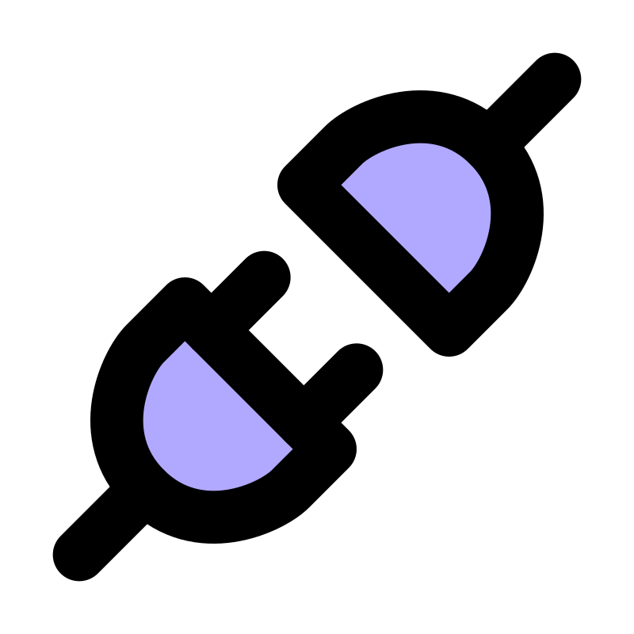
    }
    title="API Keys"
  >
    **Generate API keys to build custom integrations with Assembly.**
    
    Access the API key management page to generate and manage API keys for programmatic access to Assembly. Build custom integrations, sync data from proprietary systems, or automate workflows.

    - Generate and manage API keys
    - Access REST API documentation
    - Build custom data pipelines
  </Accordion>
</AccordionGroup>
