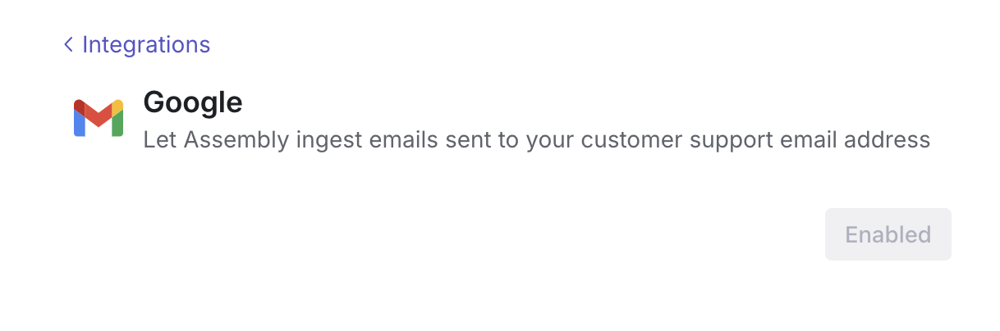

### Integrations

<AccordionGroup>
  <Accordion icon="slack" title="Slack">
    Click on the Slack integration and hit the <b>enable</b> button. After you have enabled the integration, select the <b>customer channels</b> or <b>community channels</b> sections and add the channels you’d like to collect support tickets of feedback from! 

   

    <b>Private Channels</b>
     
    If you would like to add private customer channels or community channels to Assembly’s ticket inbox, (1) @Assembly in a selected channel and then (2) reselect the same channel in the “select customer channels” dropdown. 
  

<b>Shortcuts</b>
Quick create linear, Jira, or other external tickets directly from slack by clicking the “+” button on the “create shortcut” section and selecting an emoji + destination to create the ticket
  

  </Accordion>
  <Accordion icon={<Icon icon="envelope" />} title="Email">

    To connect a support email, hit the enable button and follow the sign-in instructions. 

In order to link a forwardable account or Google Group, create a group with an authenticable email and follow the same sign in instructions as above.
 

  </Accordion>
  <Accordion icon="discord" title="Discord">
    On the Manage Integrations page, click on the Discord integration and hit the “enable” button. Follow the sign-in instructions to link discord to Assembly

 

 
After you have set up the integration, select the “customer channels” sections and add the channels you’d like to collect support tickets of feedback from! 

<b>Shortcuts</b>
In order to quick create linear, Jira, or other external tickets directly from discord, click the “+” button on the “create shortcut” section,  select an emoji or “/” (slash) command, and a destination to create the ticket
 

<b>Moderators:</b>
If your company email is not connected to your or your teams’ discord accounts, manually link all of these accounts to send respond to discord messages from the platform 

 

  </Accordion>
  <Accordion icon="github" title="GitHub Issues">
    To connect your GitHub, ensure you have admin privileges to enable the integration. Hit the “enable” button and follow the sign in instructions. 

    

    Select the repositories Assembly will have limited access to with approval if necessary

    Once the integrations is enabled, select the “repositories” (the customer channels) whose activity will come to Assembly 
    
 

<b>Moderators:</b>
If your company email is not connected to your or your teams’ GitHub accounts, manually link all of these accounts to respond to GitHub issues. 
 

 
Select the repositories Assembly will have limited access to with approval if necessary

  </Accordion>
  <Accordion icon="message" title="Chat Widget">
   Once enabled, an API key will be generated. This will be used when embedding the iframe inside your application or on a webpage. 
 

 
After this, follow the instructions on the chat widget integration page to complete installation. 

  </Accordion>
  <Accordion icon="github" title="GitHub Discussions">
   Coming soon...
  </Accordion>
  <Accordion icon="microsoft" title="Microsoft Teams">
   Coming soon...
  </Accordion>
   
</AccordionGroup>
