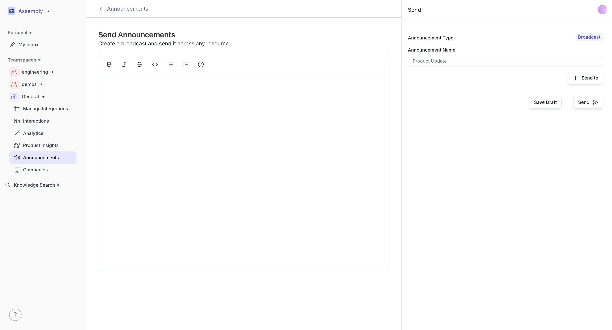
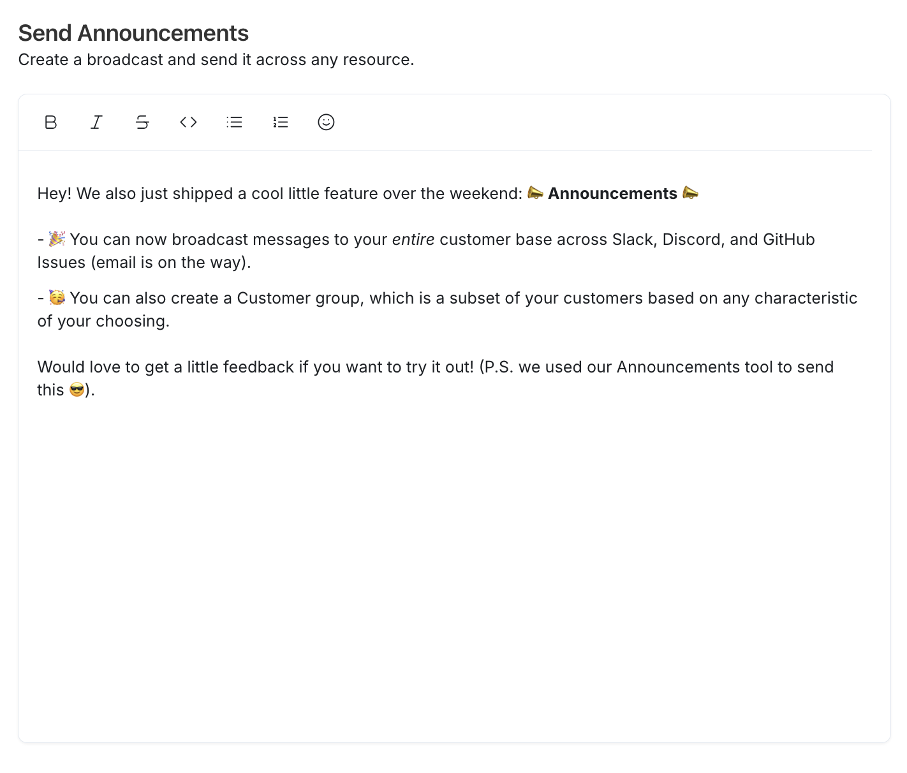

 

 

To draft an announcement, click on the “create an announcement” button on the page. Type in the name of the announcement and choose where you’d like to send the announcement to. You can send the announcement to a “customer group”, your entire customer base, a specific set of customers, or an individual one as well! 

Note, the announcement page supports real-time collaboration! Anyone can type and draft parts of your broadcast at the same time!  

 

 