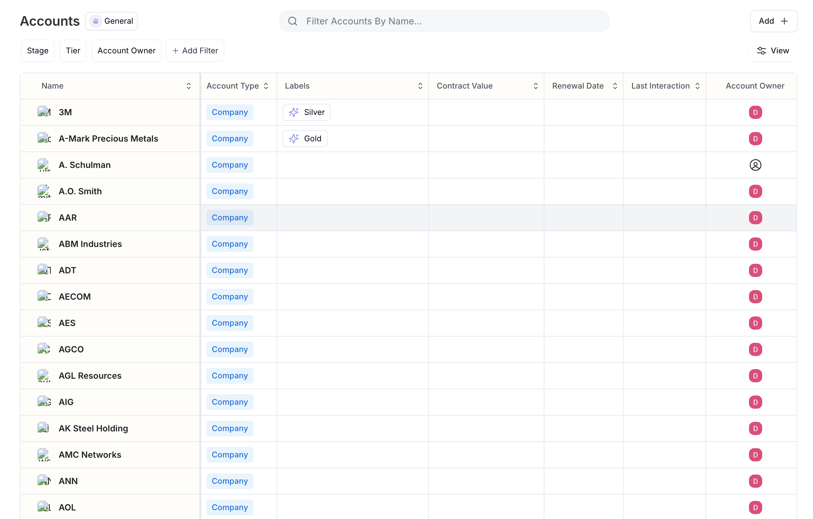
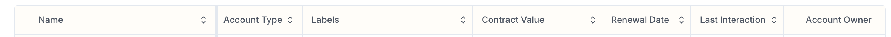
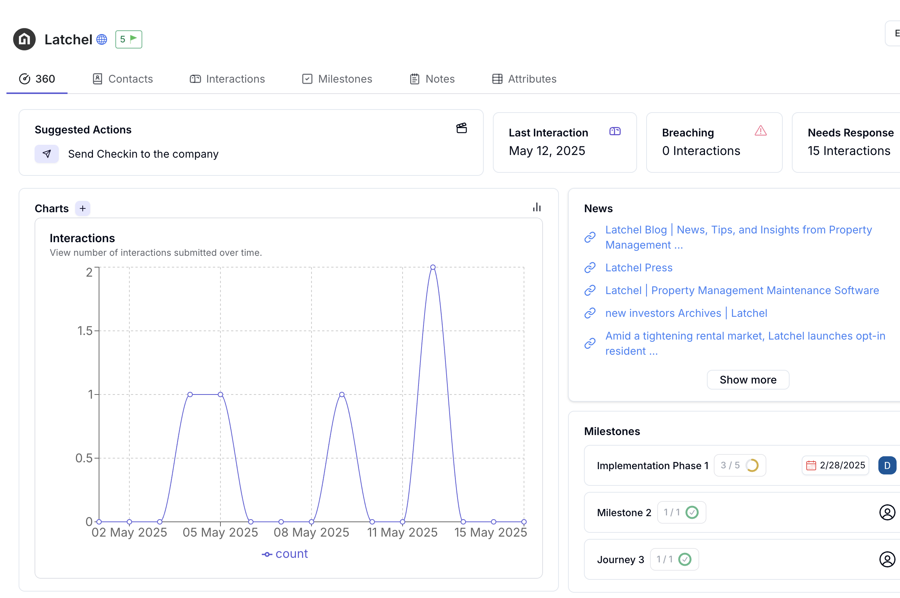
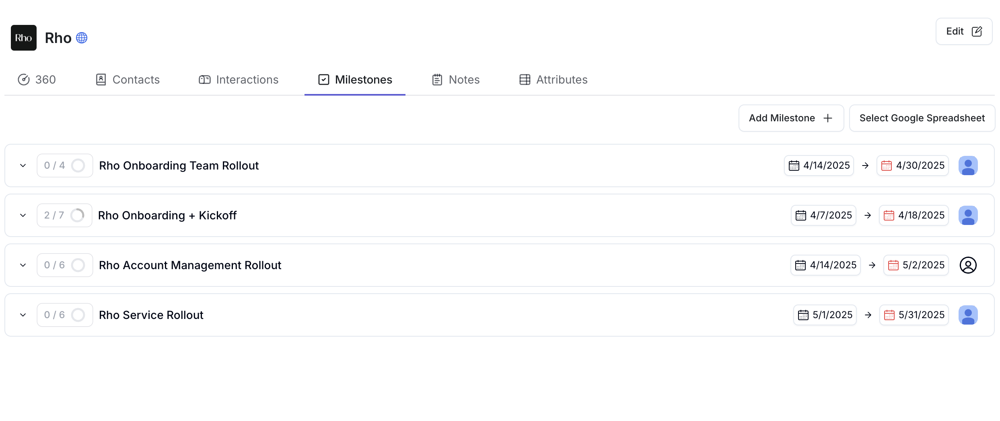

#### Setup
Other fields that natively are available within Assembly include renewal date, account labels, last interaction time, and the account assignee 

 

 

To add more fields to the table or edit existing values, right click on the customer and hit “edit”

 

You can also points of contact to existing customer profiles after clicking on the customer profile and hitting the “add contact” button

#### Customer 360

The customer 360 is meant to be the one true dashboard for any account. 
It includes usage data, recent interactions, news about the account, as well as any open milestones. 
At the top, Assembly’s LLM generates a suggested action based on all of the customer data it has available to assist CSM’s in interacting with customers at scale. 

 

 

#### Contacts

Using the account page menu bar, you can quickly navigate to the company’s contacts. This shows you the people on the account, how you’ve interacted with them, as well as when. 

#### Interactions

The account interactions page displays all of the communication (outbound or inbound), across all channels, that you have had with the account. Easily view open support tickets, escalated bugs, and more. 

#### Milestones

Tracking your customer’s journey on your platform is a main goal of using Assembly. Milestones can be configured to track your customers onboarding journey, how quickly they find value in your tool, and their power user metrics. 

#### Tasks

A collection of tasks makes a milestone! To create a task, simply use the “+” button at the end of the milestone sheet.
Make sure to name, describe, and assign the task an owner and a due date! Last but not least, track the status of your task in the status column! This refers to what will start the workflow and can be things like a new support request tagged as a bug. Now you will setup the rules for this workflow.

#### Creating Milestones
To create a milestone, click the “+Add Milestone” button on the main page. When creating a Milestone, make sure to assign it to a team member, create both start and end dates, as well as a description. 

 

 

When the tasks in a milestone are complete, the milestone’s status will change accordingly. 

#### Notes
Using the account page menu bar, you can quickly navigate to the company’s contacts. This shows you the people on the account, how you’ve interacted with them, as well as when. 

#### Attributes
In order to see additional information (attributes) about the account, navigate to the attributes page via the accounts menu bar. There, you will be able to see more information synced from your CRM (see integration support), imported fields, and other values not displayed on the accounts table

In order to edit the attributes, simply right click (two-finger on Mac) to edit the values! 