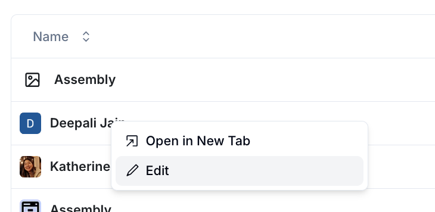

 

 

To see tickets related to a single customer, simply click on the customer in the table 

 

 
To add more fields to the table or edit existing values, right click on the customer and hit “edit”
 

 
You can also points of contact to existing customer profiles after clicking on the customer profile and hitting the “add contact” button
 

 