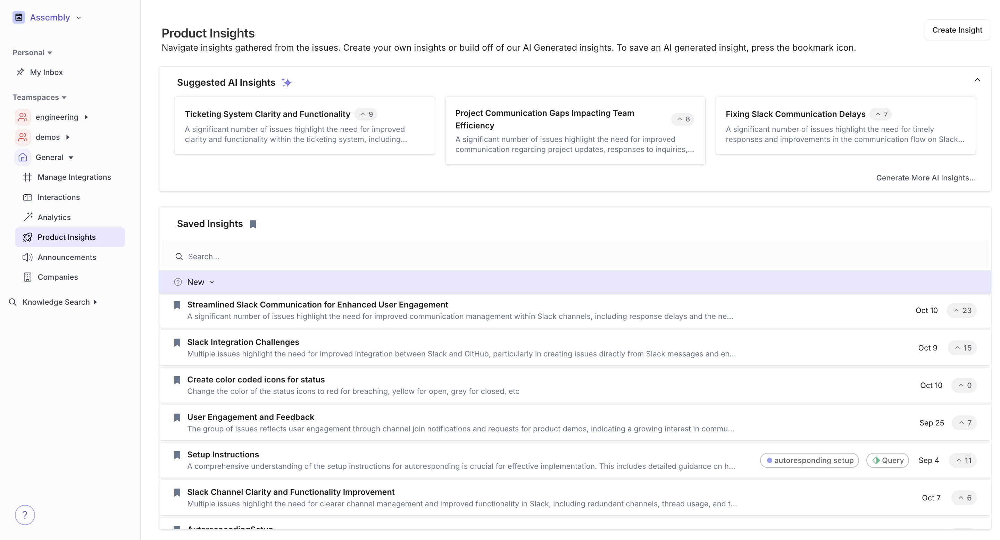
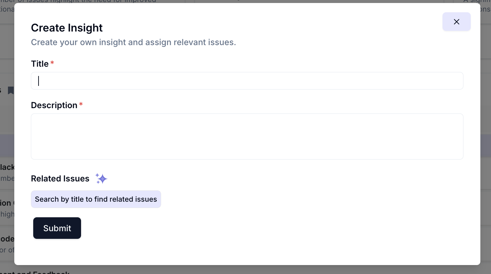
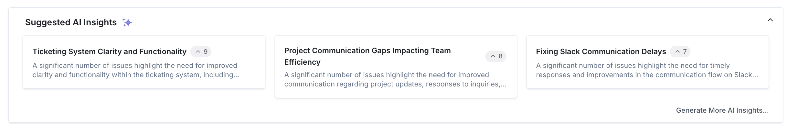
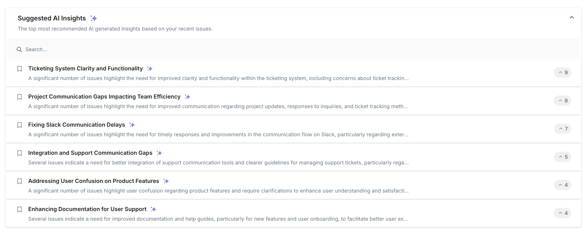

 

 

#### Creating Insights

To create an insight, click on the “create insight” button on the top right of the product insights. 

 

 

Type in the title of the insight and add a detailed description if possible! To attach existing support interactions to this insight, click the “related issues” button and manually search + add tickets to this insight. Or.. click the “sparkle” icon to use AI to link issues based on the description for you!

Once you save this insight, any new support interactions that match the description of the insight will automatically be linked.

#### Generating AI Insights

Every time you navigate to the product insights tab, our AI will automatically generate a set of insights for you. To see more than top 3 insights being displayed, click the “generate more insights button

 

 

 

 

To save a generated insight, tap the “bookmark” icon on the insight page or on it’s row in the insights table