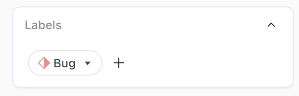
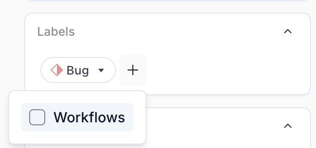
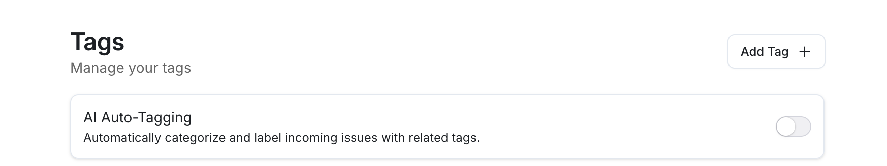
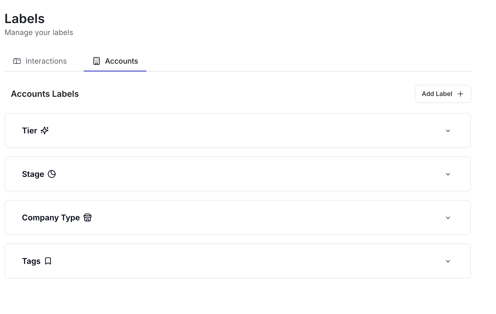

Interaction Categories refers to whether the support request is a bug, feature request, or a general question. 
This label is automatically attached to every incoming support request. You can change labels here: 

 

 

<b>Request type</b> Interaction Tag is about the product this support request is about. Examples of these tags are “billing”, “account management”, “authentication”, and more. You can turn on AI auto-tagging for these topic labels by clicking on the AI-Autotagging toggle!

 

 

<b>Request Topic</b> To create your own tag, click on the “add tag” button and provide a title and description for the label. You can filter through these tags on the labels table below

 

 

Tier: the payment method 
Stage: where the user is in the post-sale lifecycle (onboarding, live, etc)
Company: “size” of the client
Tags: entirely custom. 
You may add / edit any of these labels by clicking the “+ Add Label button” 

 

 