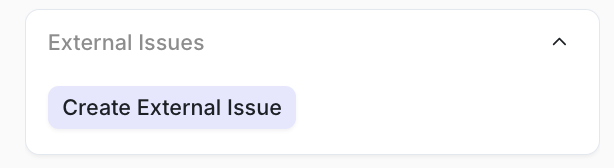

If these integrations have been enabled, just click on the “link external issue” button and create the ticket.
 

 
You can also link a product insight (covered in the customer success section of the documentation) to a support interaction. If there is an existing product insight, simply hit the “link insight” button and link the appropriate ones to this support interaction.
 

