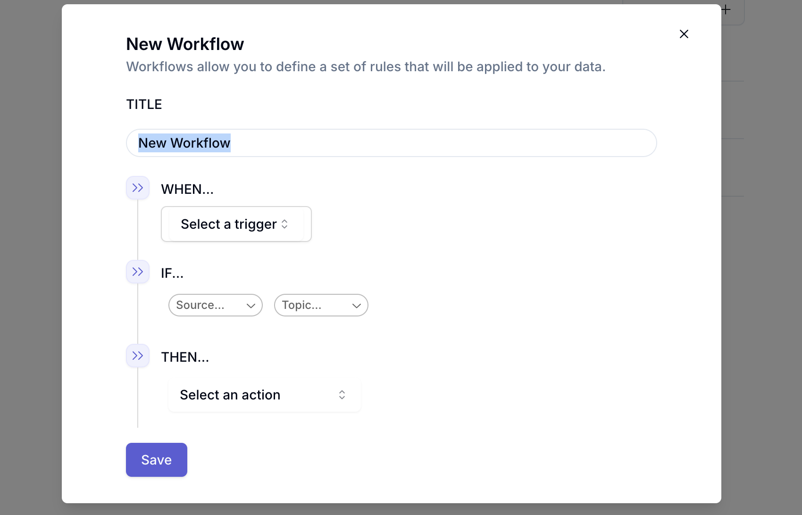

 

 

Describe the title and then select a “trigger”. This refers to what will start the workflow and can be things like a new support request tagged as a bug. Now you will setup the rules for this workflow.

 

 

Select the appropriate condition (if statement) for the workflow and then select an action. Once the ruleset for the workflow is saved, you can view them on the main workflow table! 

