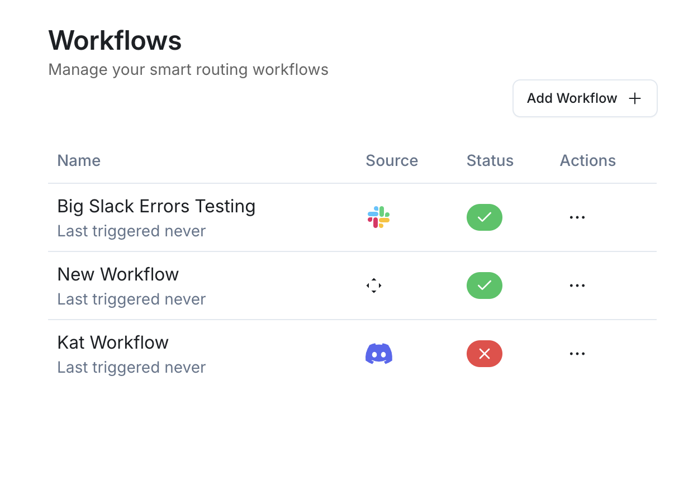
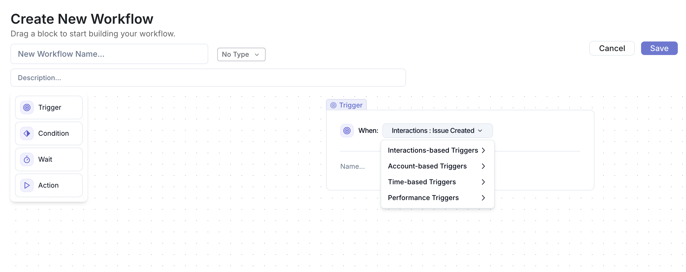
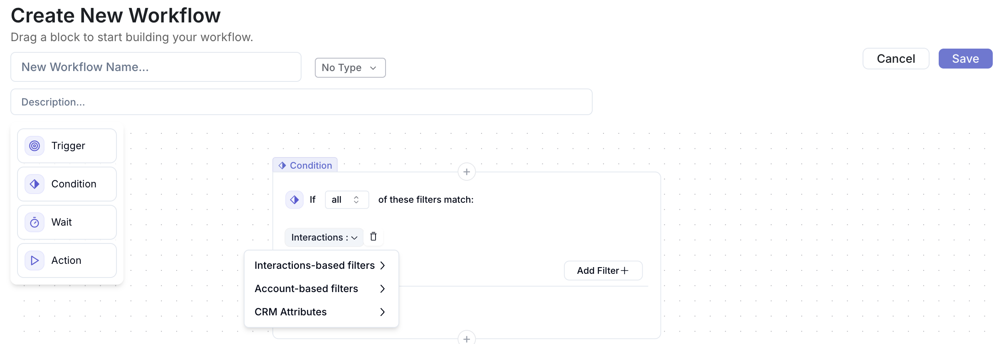
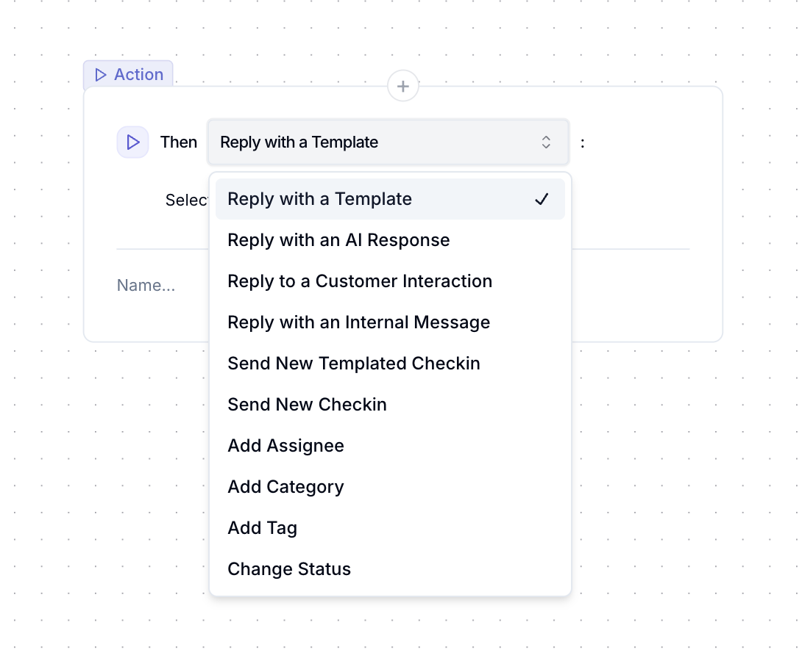

#### Setup

To create a workflow, tap on the “+ Create” on the top righthand corner of the page.
 
# change this

 

#### Creating a Workflow

Once you’ve decided which type of workflow you would like to create, you’ll see the following page 

 
# change this

 

You’ll notice the workflow tool bar on the left hand side with the following elements: triggers, conditions, waits, and actions. 

By design, a workflow needs a trigger, a condition, the lack of which suggests a blanket action for a specific trigger, and an action. With that being said, we’ll dive into what each of these mean

#### Triggers

A trigger is the element that initiates a workflow. Interaction triggers could include items such as a new interaction being created, the status being updated, a label being changed, etc. An account trigger includes elements such as when a health score is updated, specific attributes (usage, sentiment, etc) changes, as well as when the account increases their payment plan. 

br/>
# change this

 

#### Conditions

The condition(s) is the set of dependencies that the trigger may or must have for the workflow to run. On the interaction side, this could include interaction specific field updates such as status, label, assignee, team, and more. Again, the account workflow condition set reflects account size, renewal date, pricing tier, and more. 

br/>
# change this

 

#### Waits

Typically used for followups or adding a buffer between a trigger and the action, the “wait” time is exactly as advertised. Simply drag and drop the wait component and select the amount of time an action must wait before being triggered. 

#### Actions

These are the meat & potatoes of workflows. The outcome you would like to drive via interaction or account workflows are determined by the action or set of actions you setup. On the interaction side of things, the actions range from replying to customer interactions with templates (or an AI) to updating statuses, tags, and more on the interaction itself. 
Accounts on the other hand have actions such as checking in with the customer, sending renewal notices, sending slack messages to CSM’s about changes in the customer’s health, and much more. 

 

 

