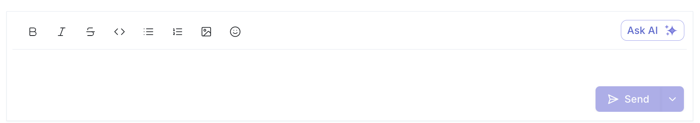

When responding to frequently asked questions or if you’re faced with a question you know whose answer exists in your KB (notion, Google drive, Confluence, Linear, etc), hit the “Ask AI” button and Assembly will use it’s platform search to query your entire KB for the answer. 

