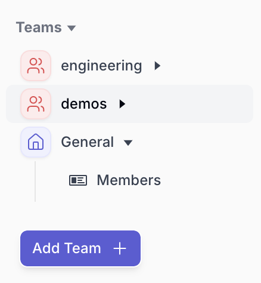
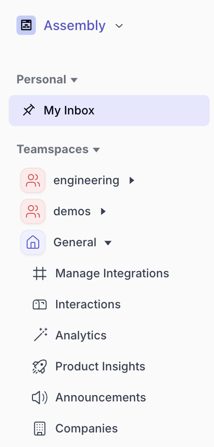

During setup, you must create at least one team (typically a “general team”) which will have access to the “all Issues” inbox. 

If you have more than one team, you may create them here: 

Once created, each individual team will be able to see their own inbox, assign tickets to team members, create their own SLA’s & tags, and more. 

