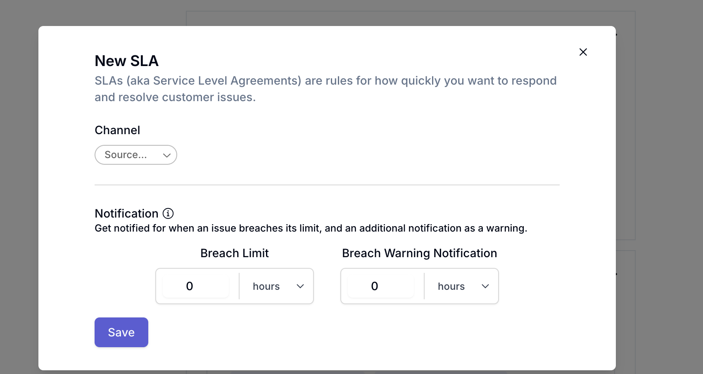

 To set one up, go to the preferences page from the dashboard and navigate to the SLA section 

There you’ll be able to determine an SLA with a breach limit (how long you have to respond) and a warning notification (when you’ll receive a bump in slack or another messenger to respond prior to breaching) 

If you are unable to respond within the SLA period, the ticket will move under the “breaching” status. Once responded to, the ticket’s SLA timer will reset for the next customer message. 

